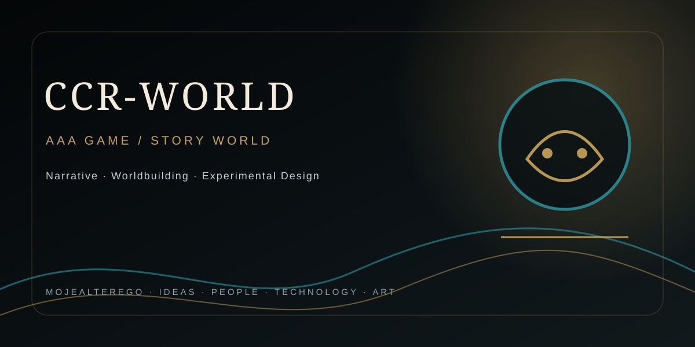

## MOJEALTEREGO · CREATIVE TECHNOLOGY

---

# CCR-WORLD

**GAME AAA · ANDROID**

## Project identity

`CCR-WORLD` is a dedicated repository within the MojeAlterego ecosystem for an AAA/game-oriented project.

At the current repository state, the public source README exposes only the project identity above. Architecture, engine, gameplay systems, build instructions and current implementation status are therefore **not inferred or fabricated here**.

## Repository

[Open CCR-WORLD on GitHub](https://github.com/mojealterego/CCR-WORLD)

## Visual identity

The repository uses the shared MojeAlterego visual system:

- obsidian / graphite base
- restrained 24K-gold accents
- cool teal technical highlights
- editorial serif titles
- cinematic project artwork

The social-preview artwork is a **conceptual project visual**, not a claim that the pictured interface or game content is already implemented.

## Development record

Technical details should be added here as they become verified from repository source, build output, demos or documented project specifications.

---

**MOJEALTEREGO · IDEAS · PEOPLE · TECHNOLOGY · ART**

